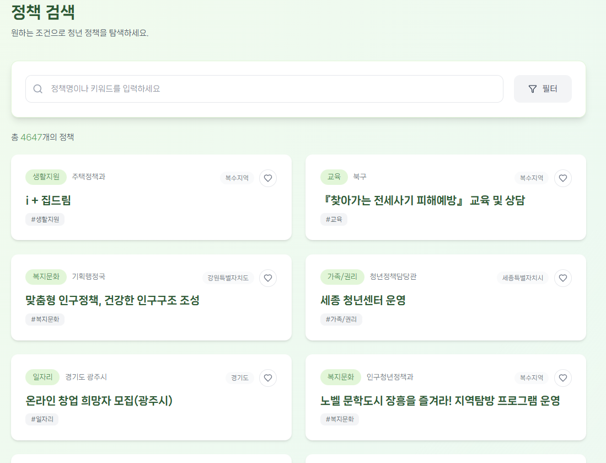
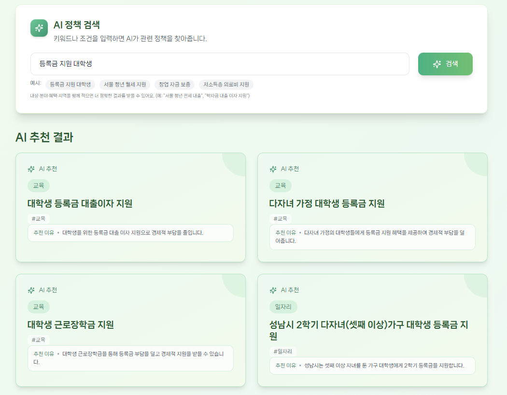
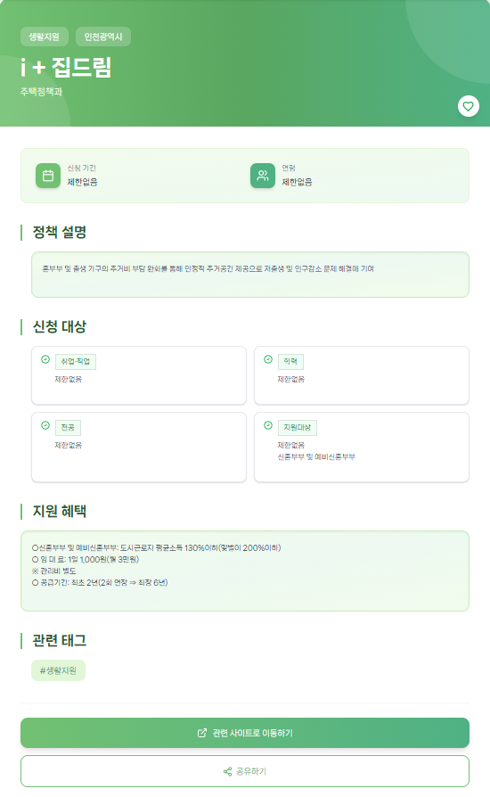
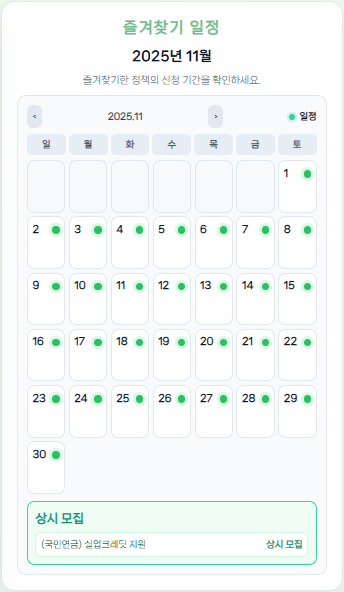
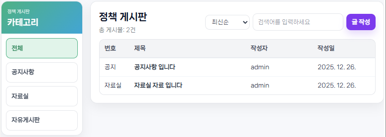

# 야무진 청년



청년 정책을 **검색·상세·추천**하고,
관심 정책을 **위시리스트와 달력으로 관리**할 수 있는
**청년 정책 통합 웹 서비스**입니다.

---

## 1. 프로젝트 개요

* 청년 정책을 한 곳에 모아 탐색·검색·추천
* 사용자 프로필 기반 맞춤 정책 추천
* 위시리스트 및 달력 기반 마감 일정 관리
* 게시판(공지 / 자료 / 자유) 제공

**기술 스택**

* Backend: Django, Django REST Framework, SQLite / PostgreSQL
* Frontend: Vue 3, Pinia, Vite
* (선택) 벡터 검색: Chroma / pgvector

---

## 2. 프로젝트 구조

### 2.1 Backend (Django)

```text
backend/
 ├ config/              # Django 설정(settings, urls, wsgi, asgi)
 ├ accounts/            # 인증(JWT) 및 사용자 계정
 ├ profiles/            # 사용자 프로필(나이/성별/지역/관심)
 ├ policies/            # 정책 모델, 시리얼라이저, 수집 커맨드
 │  └ management/
 │     └ commands/
 │        └ load_policies.py   # 정책 데이터 적재 커맨드
 ├ recommends/          # 추천 엔진, 추천 로그
 │  └ profile_engine.py # 프로필 기반 추천 핵심 로직
 ├ boards/              # 게시판(공지/자료/자유)
 └ migrations/          # DB 마이그레이션
```

### 2.2 Frontend (Vue 3)

```text
frontend/vue-project/
 └ src/
    ├ api/              # axios 래퍼 및 API 모듈
    ├ stores/           # Pinia 스토어(auth, policy, board 등)
    ├ views/            # Landing, Recommend, Boards, MyPage 등 화면
    ├ router/           # 라우팅 설정
    └ assets/           # 로고 및 정적 리소스
```

---

## 3. 브랜치 전략

* `develop`: 통합 개발 브랜치
* `feature/*`: 기능 단위 브랜치 → PR 후 develop에 병합

---

## 4. 핵심 기능

### 4.1 프로필 기반 정책 추천

* 필수 타겟 정책(장애/보훈/저소득/한부모/군인) 불일치 시 제외
* 정책에 성별 키워드가 있을 경우에만 성별 매칭
* 프로필 기반 스코어링 후 상위 정책 추천



### 4.2 위시리스트 및 달력

* 정책 저장/삭제
* 시작일·마감일 기반 달력 이벤트 생성
* 상시 모집 정책과 기간 모집 정책 분리 표시




### 4.3 게시판

* 공지 / 자료 / 자유 게시판
* 관리자 계정만 공지사항 작성 가능

---

## 5. 핵심 로직 상세

### 5.1 프로필 기반 추천 엔진

* **파일**: `backend/recommends/profile_engine.py`

**처리 흐름**

1. `get_profile_candidates(profile)`를 통해 추천 대상이 될 정책 후보군 조회
2. 정책의 `special_target`에 **필수 타겟 키워드**
   (`장애 / 보훈 / 저소득 / 한부모 / 군인`)가 포함된 경우
   → 사용자 프로필 타겟과 불일치 시 즉시 제외
3. 정책에 성별 키워드가 명시된 경우
   → `GENDER_KEYS` 기준으로 사용자 성별과 매칭 여부 검증
4. 조건을 통과한 정책에 대해
   `calculate_profile_score(policy, profile)`로 프로필 기반 유사도 점수 계산
5. 카테고리 버킷별 상위 정책을 조합하여 **다양성을 고려한 최종 추천 리스트 생성**

**핵심 포인트**

* 점수 계산 이전에 **하드 컷(hard cut) 규칙을 우선 적용**하여 추천 품질을 안정화
* “추천을 잘하는 것”보다 **“추천하면 안 되는 정책을 먼저 제거”하는 구조**
* 프로필 조건 기반 필터 → 스코어링 → 카테고리 다양화의 단계적 설계

---

### 5.2 위시리스트 → 달력 이벤트 매핑

* **파일**: `frontend/vue-project/src/views/LandingPage.vue`

**처리 흐름**

1. `/wishlist/` API 호출을 통해 사용자가 저장한 정책 ID 목록 확보
2. 각 정책에 대해 `loadPolicyById` 호출
   → 정책 상세 데이터를 다시 로드하여 `start_date / end_date` 확보
3. 달력 표시 전용 상태인 `cachedPolicies`에
   `{ title, startDate, endDate }` 형태로 저장
4. 현재 선택된 월 범위에 포함되는 정책만 달력 이벤트로 변환
5. 모집 기간이 없는 **상시 정책**은 달력과 분리된 리스트로 별도 처리

**핵심 포인트**

* 위시리스트 응답 데이터와 전체 정책 로딩 데이터 간 **상태 충돌 방지**
* “위시리스트 → 상세 로드 → 달력 변환”의 단방향 흐름으로 데이터 안정성 확보
* 날짜 정보가 불완전한 정책은 달력 이벤트에서 자동 제외

---

### 5.3 위시리스트 응답에 날짜 포함

* **파일**: `backend/policies/serializers.py`

**설명**

* `PolicyBasicSerializer`에 `start_date`, `end_date` 필드를 포함
* `/wishlist/` 응답 단계에서 이미 달력에 필요한 날짜 정보 제공
* 프론트엔드에서 추가 가공 없이 **즉시 달력 이벤트 생성 가능**

**핵심 포인트**

* 프론트 로직 단순화
* “달력 표시를 위한 데이터 책임”을 백엔드에서 명확히 분리

---

### 5.4 관리자 전용 공지 작성 UI

* **파일**: `frontend/vue-project/src/views/BoardCreateView.vue`

```vue
<select v-model="form.category">
  <option v-if="authStore.isStaff" value="notice">공지사항</option>
  <option value="review">자료실</option>
  <option value="free">자유게시판</option>
</select>
```

**설명**

* `authStore.isStaff` 값에 따라 공지사항 카테고리 선택 여부 제어
* 일반 사용자는 자료실·자유게시판만 작성 가능
* 관리자 계정만 공지 작성 UX가 노출됨

**핵심 포인트**

* 백엔드 권한 체크와 별도로
  **프론트 단계에서 작성 옵션 자체를 제한**
* 권한 오류 발생 가능성을 UI 레벨에서 사전 차단


> 야무진 정책의 핵심 로직은
> **조건 기반 선필터링 → 점수화 → 사용자 경험(UI)으로 연결**되는 구조로 설계되었으며,
> 추천·달력·권한 제어가 각각 명확한 책임 단위로 분리되어 있다.

---

## 6. ERD


---

## 7. 팀 역할

* **범석**
  인증·프로필, 추천 로직 설계/디버깅, 달력 연동, 데이터 흐름 안정화

* **예진**
  DB 설계, 정책 데이터 수집·전처리·정합성 관리, 검색/상세 API, 추천 엔진(AI)

* **보겸**
  위시리스트, 게시판, 홈/마이페이지/검색 UI, UX 개선

---

## 8. 개선 아이디어

* 벡터 검색 기반 하이브리드 검색 고도화
* 마감 임박/신규 정책 알림
* CI/CD 및 배포 파이프라인 구축
* 추천 이유 시각화 및 접근성 개선


